# flutter_api_assignment 🚀

A multi-featured Flutter project that demonstrates how to fetch and display live data from various **REST APIs** using **HTTP requests**. This app includes:

- 🌤️ Climafy - Weather App 
- 🎥 Filmfacto - Movie Info App
- 📈 Cryptels - Crypto Price Tracker
- 📰 Global Link - News Reader App  
- 🎭 Daily Dose - Quote of the Day / Joke Generator
  
 
## 📲 Apps Included

---

### 🌤️ Climafy - Weather App

Real-time weather info using the **OpenWeatherMap API**.

#### 🌦️ Features:
- Weather based on **current location** or searched city.
- Dynamic UI (backgrounds, icons based on weather).

#### 🖼️ Screenshots:

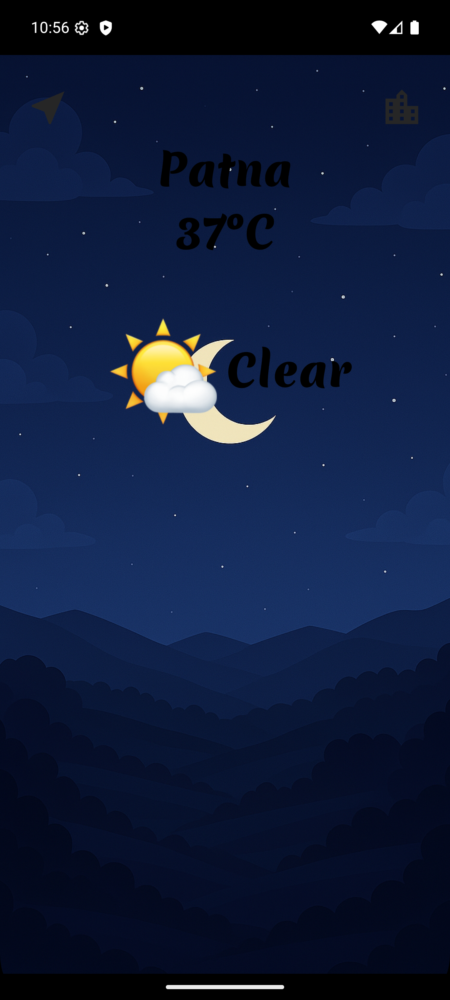
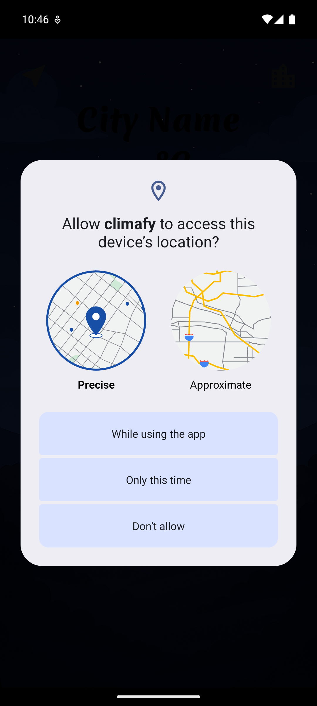
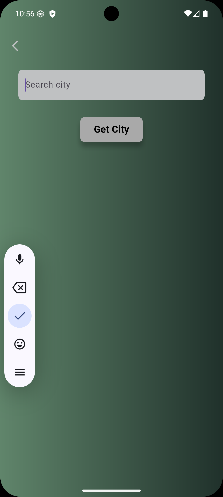

---

### 🎥 Filmfacto - Movie Info App

Fetch details of new and classic movies using **The Moviedb API**.

#### 🎞️ Features:
- Search by movie name.
- Displays movie data (name, poster, rating, etc.).

#### 🖼️ Screenshots:
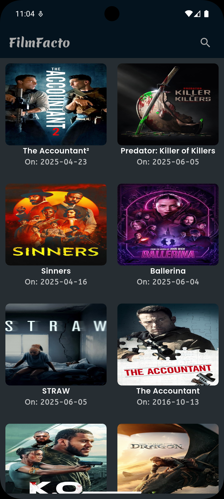
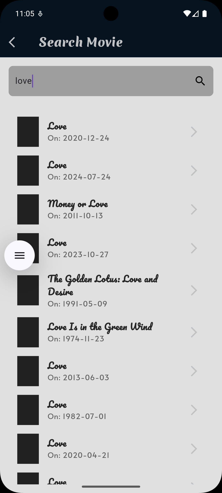
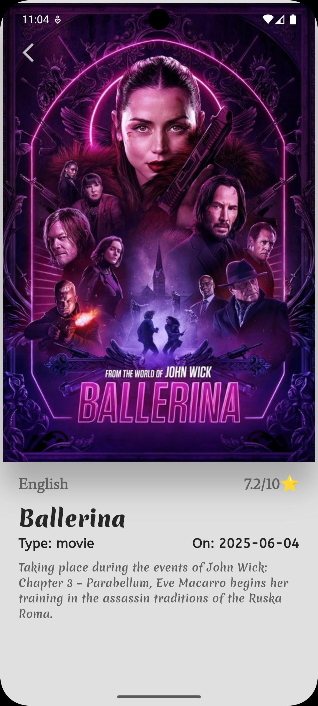

---

### 📈 Crypto Price Tracker

Tracks real-time prices of cryptocurrencies using the **CoinGecko API**.

#### 🔍 Features:
- Search by coin name or symbol.
- Displays live data (price, market cap, etc.)

#### 🖼️ Screenshots:
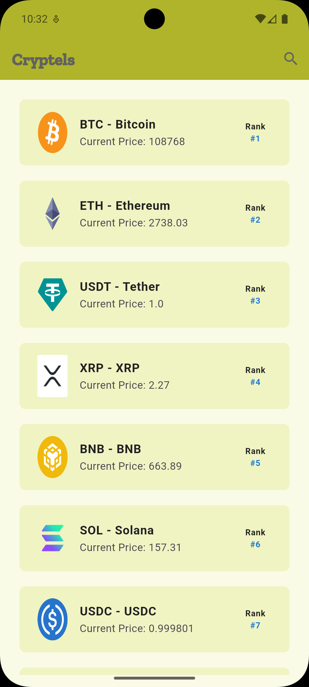
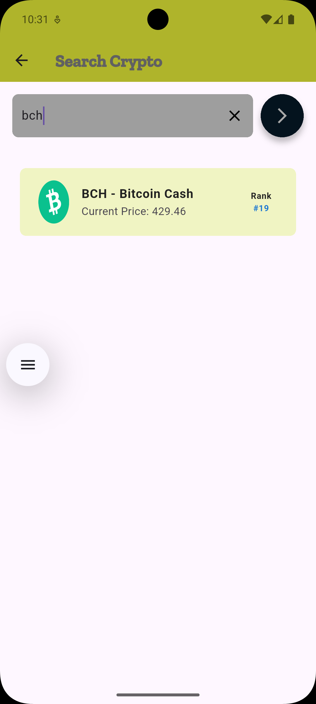
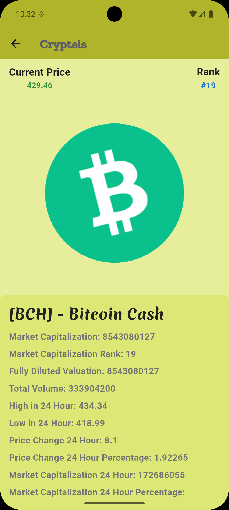

---

### 📰 Global Link - News Reader App 

Reads news **The News API**.

#### 🗞️ Features:
- Showing trending news on home page.
- Displays news using (title, poster, author, etc.)
- Search functionality included.

#### 🖼️ Screenshots:

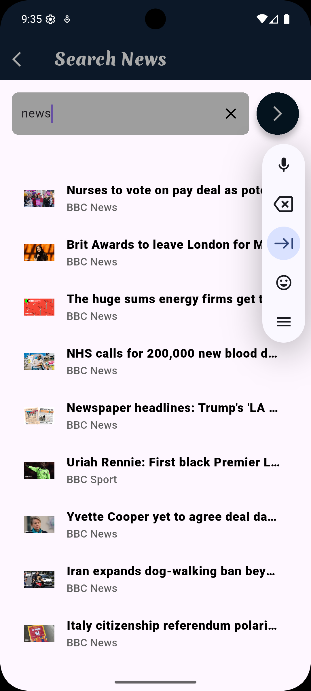

---

### 🎭 Daily Dose - Quote of the Day / Joke Generator

Fetches daily quotes from **Quotable API** and random jokes from **JokeAPI**.

#### 😄 Features:
- Tap the refresh button to get a new joke or quote.
- Automatically fetches on app launch.
- Clean card-based UI.

#### 🖼️ Screenshots:
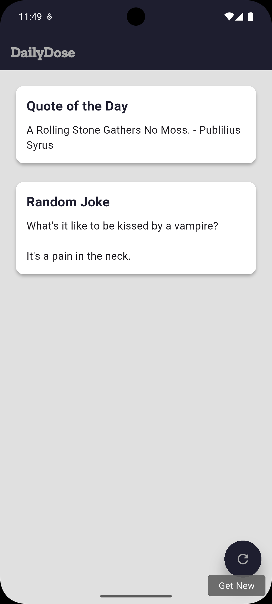

---

## 🤯 Core Concepts Covered

- REST API integration using `http` package.
- JSON parsing and data modeling.
- State management using `setState()`.
- Loading and error states.
- Responsive UI design.

---

## 🛠️ Built With

- **Flutter** – UI toolkit
- **Dart** – Programming Language
- **HTTP Package** – API calls
- **OpenWeatherMap, CoinGecko, Quotable, JokeAPI** – REST APIs

---

## 🙋‍♂️ Author

Made with ❤️ by- [Rahul Mishra](https://github.com/rahulmishra-09)

